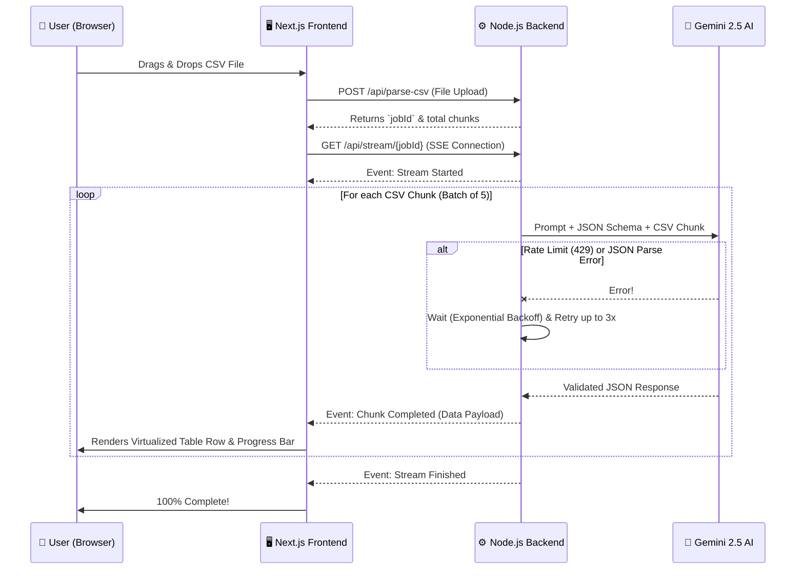

<div align="center">
  
  # 🚀 LeadMorph AI
  
  **An Intelligent, AI-Powered CRM Importer**

  [](https://nextjs.org/)
  [](https://nodejs.org/)
  [](https://www.typescriptlang.org/)
  [](https://aistudio.google.com/)
  [](https://www.docker.com/)

  ### 🌐 [Live Demo (Vercel)](https://lead-morph-ai.vercel.app/)
  ### 🔌 [API Endpoint (Railway)](https://leadmorph-ai-production.up.railway.app/)

  *LeadMorph AI eliminates the need for manual data mapping. Drop in any messy CSV, and watch the AI instantly extract, structure, and validate the leads into a clean CRM format.*
</div>

---

## ✨ Key Features

- 🧠 **Intelligent Field Mapping**: Upload any CSV (Facebook Leads, Google Ads, arbitrary spreadsheets) and the AI automatically understands the context and maps it to the target schema.
- ⚡ **Real-Time Streaming**: Utilizing Server-Sent Events (SSE), the frontend updates in real-time as the AI processes batches of data. No more endless loading spinners!
- 🛡️ **Robust AI Retry Engine**: Processes massive CSVs by chunking them into memory-efficient batches. Features **Exponential Backoff** to gracefully handle LLM rate limits and hallucinations.
- 🚀 **Performance Focused**: Renders 100,000+ rows instantly without crashing your browser thanks to a fully virtualized table (`react-window`).
- 🌙 **Modern UX**: Beautiful Light & Dark mode, drag-and-drop uploads (`react-dropzone`), and sticky-header preview tables.
- 🔒 **Stateless Architecture**: Files are processed securely in memory via `multer` without ever touching the disk.

---

## 🏗 Architecture & Workflow

The architecture is designed to be highly resilient against AI failures and capable of handling massive datasets smoothly.



---

## 🚀 Setup Instructions

You can run this project either natively or using Docker.

### 🔑 Prerequisites
1. Get a free Google Gemini API Key from [Google AI Studio](https://aistudio.google.com/).

---

### Option A: Running with Docker (Recommended)
The fastest way to get started. You need [Docker Desktop](https://www.docker.com/products/docker-desktop/) installed.

1. Create a `.env` file in the `backend/` directory:
   ```env
   PORT=4000
   FRONTEND_URL=http://localhost:3000
   GEMINI_API_KEY=your_api_key_here
   BATCH_SIZE=5
   ```
2. From the root directory, run:
   ```bash
   docker-compose up --build
   ```
3. Open `http://localhost:3000` in your browser!

---

### Option B: Running Locally (Native)
You will need Node.js v18+.

**1. Backend Setup**
```bash
cd backend
npm install
```
Create `backend/.env` exactly like the Docker setup above, then start the server:
```bash
npm run dev
```

**2. Frontend Setup**
Open a new terminal window:
```bash
cd frontend
npm install
npm run dev
```
Open `http://localhost:3000` in your browser.

---

## 🧠 AI Validation Rules

The backend strictly enforces the following rules to ensure absolute data integrity before it reaches your database:

1. **Strict Enums:** 
   - `crm_status` is forced to one of: `GOOD_LEAD_FOLLOW_UP`, `DID_NOT_CONNECT`, `BAD_LEAD`, `SALE_DONE`.
   - `data_source` is forced to one of: `leads_on_demand`, `meridian_tower`, `eden_park`, `varah_swamy`, `sarjapur_plots`.
2. **Data Compression:** Extra phone numbers, secondary emails, or ambiguous remarks found in the CSV are intelligently compressed and appended into the `crm_note` field.
3. **Graceful Skips:** If a record is missing BOTH an email and a mobile number, it is safely marked as "Skipped" (Validation Error) rather than polluting the CRM.

---

## 📂 Project Structure

```text
LeadMorph AI/
├── backend/
│   ├── src/
│   │   ├── routes/          # Express API Endpoints (SSE, Upload)
│   │   ├── services/        # Business Logic (CSV Parsing, Gemini AI)
│   │   ├── tests/           # Jest Unit Tests
│   │   └── types/           # Global TypeScript Interfaces
│   ├── Dockerfile           # Backend Image
│   ├── jest.config.js       # Test Runner config
│   └── package.json
├── frontend/
│   ├── src/
│   │   ├── app/             # Next.js App Router (page.tsx, globals.css)
│   │   └── lib/             # API Helpers & Constants
│   ├── Dockerfile           # Frontend Image
│   └── next.config.ts
├── test_lead.csv            # Sample messy CSV for testing
└── docker-compose.yml       # Orchestrates frontend + backend
```

---

## 🏆 Extra Credit Features Achieved
✅ **Drag & Drop Upload**: Integrated seamless file dropping (`react-dropzone`).<br>
✅ **Streaming & Incremental Parsing**: Built a complex Server-Sent Events (SSE) pipeline to stream data back chunk-by-chunk.<br>
✅ **Retry Mechanism**: Backend automatically catches rate limits (429) and JSON parse failures, retrying chunks up to 3 times with exponential backoff.<br>
✅ **Virtualized Table**: Integrated `react-window` to ensure the DOM never crashes, even with huge CSVs.<br>
✅ **Dark Mode**: Beautiful CSS-variable driven theme toggle.<br>
✅ **Unit Tests**: Full Jest test suite for the CRM validation logic.<br>
✅ **Docker Setup**: Fully containerized and ready for 1-click cloud deployment.
